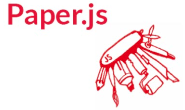
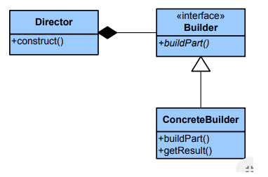
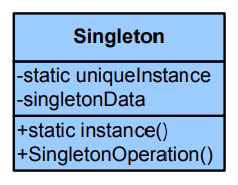
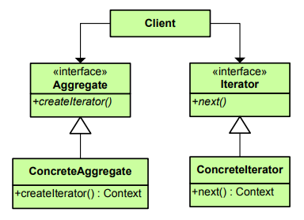

## Agar.io

### Arquitectura y tecnologías

Esta versión de agar.io se creará utilizando estas tecnologías:

1)	Vainilla JavaScripty jquery por estructura y lógica
2)	HTML5 Canvas y paper.js para renderizar
3)	Webpack para empaquetar

- [ ] **board.js:** maneja la creación del tablero de juego, así como la pantalla de inicio inicial

- [ ] **cell.js:** maneja la lógica de las celdas, así como los atributos de cada celda, como massy color.

- [ ] **human_player.js:** maneja las entradas del teclado y el mouse del jugador humano.

- [ ] **computer_player.js:** se encarga de la lógica del NPC (celda no jugable).

- [ ] **food.js:** responsable de generar pequeños trozos de comida que las células pueden comer cuando no están comiendo otras células.

### Webpack:

 Es un paquete de módulos JavaScript de código abierto. Está hecho principalmente para JavaScript, pero puede transformar activos de front-end como HTML, CSS e imágenes si se incluyen los cargadores correspondientes. webpack toma módulos con dependencias y genera activos estáticos que representan esos módulos.

 

 ### Paper.js:

 Es una librería que te permita crear y trabajar con gráficos vectoriales. El sitio oficial lo describe como la Navaja Suiza del Scripting de Gráficos Vectoriales.

 

 ### Patrones de creación

**Builder:** Separa la construcción de un objeto complejo de su representación, de forma que el mismo proceso de construcción pueda crear diferentes representaciones.

 

**Singleton:** Garantiza que una clase sólo tenga una instancia, y proporciona un punto de acceso global a ella.

 

 ### Patrones de comportamiento.

**Iterator:** Proporciona un modo de acceder secuencialmente a los elementos de un objeto agregado sin exponer su representación interna.

 